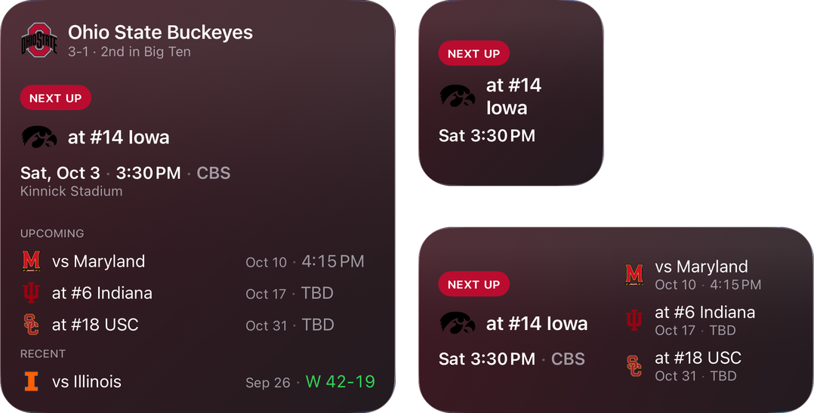

# CFB Schedule Widget

Widgets for a college football team's schedule — on the Mac desktop, the iPhone
Home Screen, and the iPhone Lock Screen — plus a small host app that shows the
full season. Pick any of the 762 teams ESPN publishes, per widget and
independently in the app. Tapping a Home Screen or desktop widget opens that
team's page on ESPN.



> This is an independent hobby project. It is not affiliated with, endorsed by,
> or sponsored by the NCAA, ESPN, or any school. Team names, logos, and schedule
> data belong to their respective owners.

## Requirements

- A Mac on Apple silicon running macOS 26
- Xcode 26 or later
- [XcodeGen](https://github.com/yonaskolb/XcodeGen): `brew install xcodegen`
- For iPhone: iOS 26. The Simulator needs nothing extra; a real iPhone needs an
  Apple developer team (a free personal team works — see
  [Running on an iPhone](#running-on-an-iphone)).

## Getting started

```sh
git clone https://github.com/bnicoloulias/CFBScheduleWidget.git
cd CFBScheduleWidget
xcodegen generate
open CollegeFootballSchedule.xcodeproj
```

Run the **CollegeFootballSchedule** scheme once with **My Mac** or an iPhone
Simulator as the destination, then [add the widget](#installing-the-widget). No
account, API key, or signing team is needed for either.

## What it shows

| Family | Content |
| --- | --- |
| Small | The next game: opponent, rank, kickoff, TV network |
| Medium | The next game beside the three after it |
| Large | Record and standing, the next game, the rest of the slate, recent results |
| Lock Screen rectangular | The matchup, then kickoff and network, or the live score and clock |
| Lock Screen inline | One line above the clock, e.g. "at MICH · Sat 3:30 PM" |
| Lock Screen circular | The opponent over the kickoff day, the score, or the result |

The Lock Screen families are iPhone only. iPhone text runs larger than the
Mac's, so on iPhone the Home Screen widgets use more compact layouts: shorter
kickoff lines ("Tue 3:30 PM"), dates beside or beneath each game rather than in
a second column, one recent result instead of two in Large, and a live score
that drops to a tighter line or two scoreboard rows rather than truncating.

While a game is being played the widget switches to a live score and clock and
refreshes every five minutes. Between games it refreshes every three hours, and
always wakes up in time for kickoff. iOS budgets widget refreshes, so on iPhone
the live score can lag behind the five-minute target.

## Data

Schedules come from ESPN's college-football site API, which needs no key:

```
https://site.api.espn.com/apis/site/v2/sports/football/college-football/teams/<id>/schedule
https://site.api.espn.com/apis/site/v2/sports/football/college-football/teams?limit=1000
```

**This API is unofficial and undocumented.** ESPN does not publish or support
it, and it can change shape, rate-limit, or disappear without notice — if the
widget suddenly shows "unavailable", that is the first thing to suspect. The
decoder is deliberately tolerant (unknown statuses, missing fields, and
alternate score shapes degrade rather than fail), but it cannot survive the
endpoint going away.

The team list comes from the second URL and feeds both the widget's
configuration picker and the app's team chooser. An unconfigured widget follows
the default in `Shared/Models/Team.swift` (Ohio State, id `194`).

Logos come from `a.espncdn.com` and are downsampled and cached on disk, because
a widget cannot load images while it renders — they have to be resolved into the
timeline entry ahead of time.

## Building

The Xcode project is generated, so `project.yml` is the source of truth. Run
`xcodegen generate` after pulling or after adding files, then build in Xcode or
from the command line:

```sh
xcodebuild -project CollegeFootballSchedule.xcodeproj -scheme "CollegeFootballSchedule" \
  -destination 'platform=macOS,arch=arm64' build
xcodebuild -project CollegeFootballSchedule.xcodeproj -scheme "CollegeFootballSchedule" \
  -destination 'platform=macOS,arch=arm64' test
xcodebuild -project CollegeFootballSchedule.xcodeproj -scheme "CollegeFootballSchedule" \
  -destination 'generic/platform=iOS Simulator' build
```

Tests run on the Mac; the iOS build checks that everything compiles for iPhone.

**Do not pass `-derivedDataPath`.** Without it these commands write to the same
`~/Library/Developer/Xcode/DerivedData` directory Xcode uses, so every build
replaces the last one and exactly one copy of the app exists.

This matters more than it looks, because of widgets. Every build runs a
`RegisterWithLaunchServices` phase that registers the product, so each distinct
output location leaves behind another registered copy of
`com.bobbynicoloulias.CollegeFootballSchedule.Widget`. macOS has no rule preferring the
newest, and a widget already on the desktop stays bound to whichever copy it was
added from — so it can go on running months-old code that no amount of editing
or rebuilding will dislodge, with no error anywhere to explain it. A single
`-derivedDataPath build` has cost this project one long debugging session
already.

The location does not help: the registration is explicit, not a side effect of
Spotlight, so building to `/tmp` or anywhere else outside the repo registers
just the same. Sameness is what matters, not where.

Signing is ad-hoc ("Sign to Run Locally") so it builds with no provisioning
profile and runs on the Mac that built it, or in the iOS Simulator. An ad-hoc
build copied to another Mac will be blocked by Gatekeeper; build from source
there instead. A real iPhone needs a signing team, set per developer as
described below. If you fork the project, change `bundleIdPrefix` in
`project.yml` too.

### Running on an iPhone

A real iPhone won't install an ad-hoc build, so for the `iphoneos` SDK only the
targets switch to automatic signing with your own team. The team stays out of
the repo:

1. Create `Config/Local.xcconfig` (gitignored) containing your team ID, which is
   listed in Xcode under **Settings → Accounts**:

   ```
   DEVELOPMENT_TEAM_ID = ABCDE12345
   ```

2. Change `bundleIdPrefix` in `project.yml` to something of your own, e.g.
   `com.yourname`. Bundle identifiers are unique across all teams, so Xcode
   won't provision the ones this repo uses for anyone else's team.
3. Run `xcodegen generate`, pick your iPhone as the destination, and run.

A free personal team works, but apps it signs expire after seven days and must
be re-run from Xcode.

Code is formatted with swift-format from the Xcode toolchain, configured by
`.swift-format`:

```sh
xcrun swift-format format --in-place --recursive App Shared Widget Tests
```

## Installing the widget

Build and run the app once first — neither macOS nor iOS lists a widget until
its host app has launched. Each widget then keeps its own team choice.

On the Mac:

1. Right-click the desktop and choose **Edit Widgets**, or click the date in the
   menu bar to open Notification Center and scroll to **Edit Widgets**.
2. Find **CFB Schedule Widget** and drag the size you want onto the desktop.
3. Right-click the widget and choose **Edit "CFB Schedule Widget"** to pick a
   team.

On iPhone:

1. Touch and hold an empty part of the Home Screen, tap **Edit → Add Widget**,
   find **CFB Schedule Widget**, and add the size you want.
2. For the Lock Screen, touch and hold the Lock Screen, tap **Customize → Lock
   Screen**, then tap the widget area and choose one of the **CFB Schedule
   Widget** sizes.
3. Touch and hold the widget and choose **Edit Widget** to pick a team.

The troubleshooting below is for the Mac, where LaunchServices and `chronod`
can keep a widget on old code. On iPhone, deleting the app and running it again
from Xcode clears the same kind of staleness.

### When the widget ignores your changes

Edits land, the build succeeds, and the widget on the desktop keeps behaving
like the old code — usually a duplicate registration rather than a caching
problem. Check how many copies macOS knows about:

```sh
/System/Library/Frameworks/CoreServices.framework/Frameworks/LaunchServices.framework/Support/lsregister \
  -dump | grep "path:" | grep -o "/.*CollegeFootballScheduleWidget.appex" | sort -u
```

One line is healthy. More than one means a stale copy is in play, and it may be
the one being drawn. Unregister each bad path, then delete it:

```sh
LSREG=/System/Library/Frameworks/CoreServices.framework/Frameworks/LaunchServices.framework/Support/lsregister
"$LSREG" -u "/path/to/stale/CFB Schedule Widget.app"
rm -rf /path/to/stale/build-dir
killall chronod
```

Deleting the files alone is not enough — the registration outlives them, so
`lsregister -u` has to come first. Afterwards run the app once, remove the
widget from Notification Center, and re-add it; the existing instance stays
bound to the registration you just removed.

Worth knowing: build output is gitignored, so a stale copy can sit in the
working tree indefinitely without ever appearing in `git status`.

### When the gallery shows an old name or no Edit Widget option

A different staleness, with a different cause. If the widget gallery still
shows a previous `configurationDisplayName`, or right-clicking a freshly added
widget offers no **Edit Widget**, the build is fine and `chronod` is serving a
cached descriptor.

`chronod` keys each extension's descriptor on a version string built from
`CFBundleShortVersionString` and `CFBundleVersion`, and will not re-read the
extension while that string is unchanged. Since both are pinned in
`project.yml`, every build produces the same version — so a widget's name,
description, and even its configuration type can stay frozen at whatever they
were the first time it was ingested, no matter how many times you rebuild or
remove and re-add the widget.

Bump the build number and rebuild:

```sh
# project.yml -> settings.base.CURRENT_PROJECT_VERSION
killall chronod          # launchd restarts it
```

Both targets' plists take their version from the build settings
(`CFBundleVersion: $(CURRENT_PROJECT_VERSION)`), so the bump propagates. To
confirm `chronod` re-read it:

```sh
sqlite3 ~/Library/Group\ Containers/group.com.apple.chronod/chronod/chrono.sql \
  "select version from ExtensionMetadata where bundleIdentifier like '%Widget%'"
```

The version there should match the build you just made. Changing a widget from
`StaticConfiguration` to `AppIntentConfiguration` also needs the widget removed
and re-added, since a placed instance does not migrate across that change.

### After renaming the project or its folder

Xcode derives the DerivedData directory name from a hash of the project's
path, so renaming either the project or the folder above it produces a
**second** tree. The old one keeps its build, and that build stays registered
with LaunchServices — so a pre-rename copy with none of your recent changes
competes with the current one. It is the duplicate-registration problem above,
reintroduced by a rename rather than by a stray `-derivedDataPath`.

Check for extra trees after any rename:

```sh
ls -dt ~/Library/Developer/Xcode/DerivedData/<ProjectName>-*
```

More than one means the older ones are stale. Unregister and delete each:

```sh
LSREG=/System/Library/Frameworks/CoreServices.framework/Frameworks/LaunchServices.framework/Support/lsregister
"$LSREG" -u "<old-tree>/Build/Products/Debug/CFB Schedule Widget.app"
rm -rf <old-tree>
```

Then confirm one registration remains, using the check at the top of this
section.

### When a new or changed app icon does not appear

The widget gallery stores no icon of its own — its descriptor holds only the
containing app's bundle identifier, and the icon is resolved live through
LaunchServices when the row is drawn. So if the asset catalog is right and
`lsregister -dump` shows `iconName: AppIcon` for the app, every layer you can
inspect is already correct and the stale copy is in a running process.

`Dock` and `NotificationCenter` render the gallery and hold resolved icons in
memory for the life of the process — easily days. A bundle identifier that
existed *without* an icon before you added one will keep showing none until
they restart:

```sh
killall Dock NotificationCenter     # both relaunch immediately
```

Verify what LaunchServices would hand them, which is the same lookup the
gallery performs:

```sh
"$LSREG" -dump | grep -A80 "CFB Schedule Widget.app (0x" | grep -iE "iconName|icon flags"
```

(`$LSREG` as defined above — the tool is not on `PATH`.)

Note this is *not* what `CURRENT_PROJECT_VERSION` fixes: the icon is not part
of the cached descriptor, so bumping the version re-ingests the name,
description and configuration but does nothing for the icon.

## Layout

```
Shared/     Models, ESPN networking, and the views both targets draw with
App/        The host app (Mac window and iPhone screen): full season list
Widget/     WidgetKit extension: timeline provider, family switch, WidgetKit previews
Tests/      Decoding, snapshot selection, display formatting, and refresh-cadence tests
Config/     Signing.xcconfig, plus your gitignored Local.xcconfig for iPhone signing
```

`Shared/Models/WidgetRefreshPolicy.swift` decides when the widget next wakes up;
it lives outside the extension so it can be unit tested. The per-family layouts
live in `Shared/Views` so the app's Mac canvas previews can draw them; each
view keeps its spacing and sizes in a private `DrawingConstants` enum, and
`AppTheme` holds the shared values, including `prefersCompactWidgets`, which
switches the iPhone layouts on.

[`ARCHITECTURE.md`](ARCHITECTURE.md) walks through every file and explains why
the code is shaped the way it is.

## License

MIT — see [LICENSE](LICENSE). The license covers this code only, not the team
names, logos, or schedule data the app displays.
